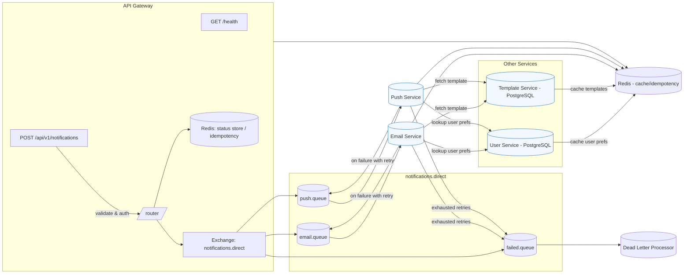

# System Design - Distributed Notification System

This document contains a high-level system design diagram (Mermaid) and explanations required for submission.

## Mermaid Diagram

## Explanation

- Service connections:
  - Clients call the API Gateway which validates requests and pushes messages to the `notifications.direct` exchange.
  - Email and Push services consume from `email.queue` and `push.queue` respectively.
  - Services use synchronous REST calls to User and Template services when they need authoritative data.

- Queue structure:
  - Exchange: `notifications.direct` (direct)
  - Routing keys: `email`, `push`
  - Queues:
    - `email.queue` → Email Service
    - `push.queue` → Push Service
    - `failed.queue` → Dead-letter queue for permanent failures

- Retry & failure flow:
  - Consumers attempt processing and acknowledge.
  - On transient failures, consumer requeues message with exponential backoff (retry util).
  - After N retries message is routed to `failed.queue` for manual inspection or dead-letter processing.

- Database relationships:
  - User Service: PostgreSQL storing user profiles, preferences, push tokens
  - Template Service: PostgreSQL storing templates and versions
  - Redis: shared cache for preferences and idempotency keys. Notification status stored in Redis for fast lookups.

- Scaling Plan:
  - Each microservice is stateless and can be horizontally scaled by increasing the number of consumer instances.
  - RabbitMQ scales by adding consumers; consider sharding or partitions for very high throughput.
  - PostgreSQL scales with read replicas for templates and users; write scale requires partitioning if necessary.

## Artifacts for Submission
- Diagram (Mermaid) is included above and also hosted in this repo: `docs/SYSTEM_DESIGN.md`.

---

*Generated on:* 2025-11-14
